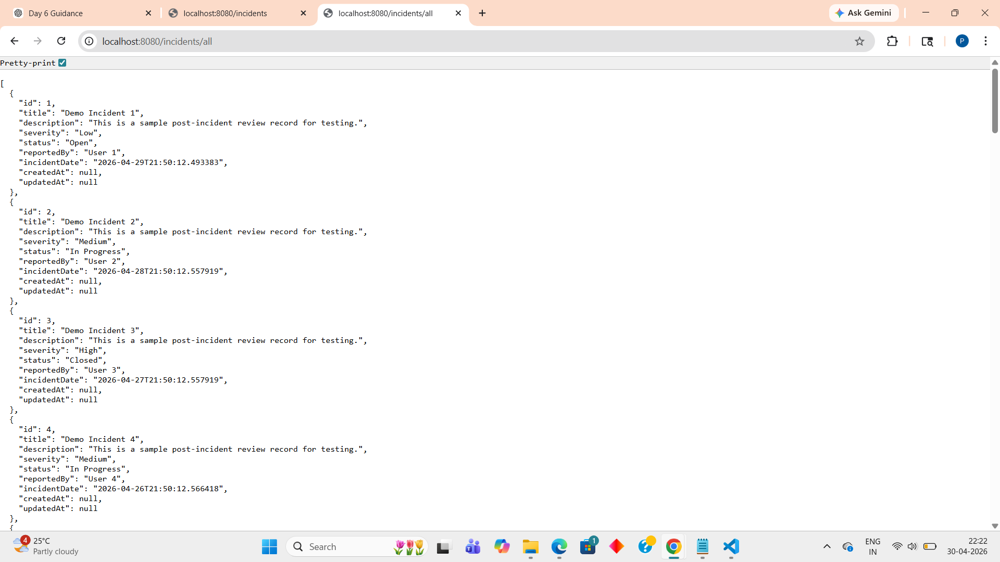
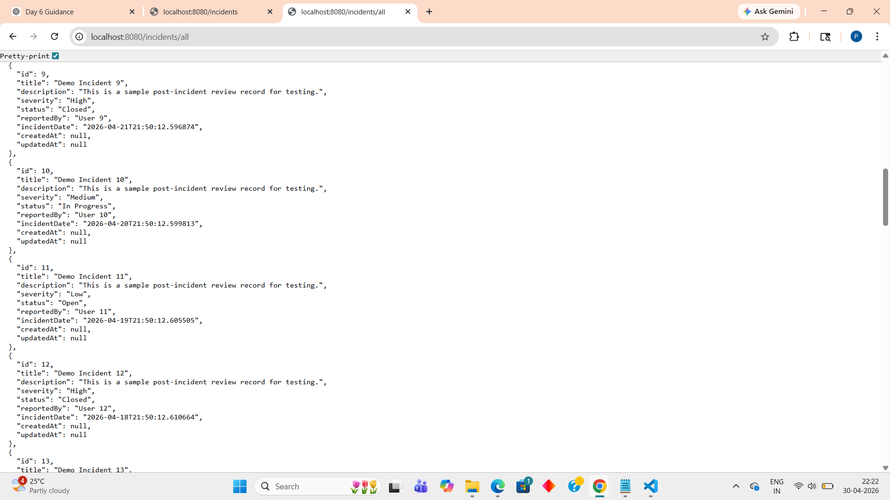
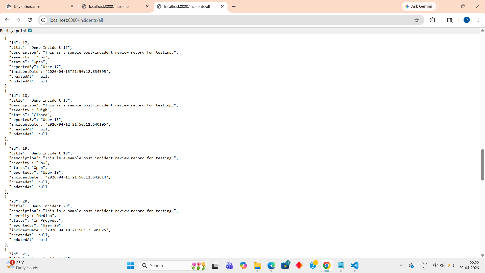
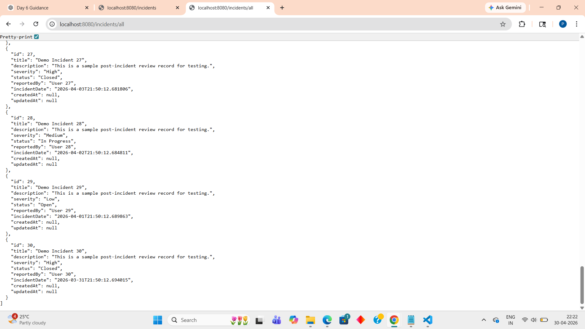
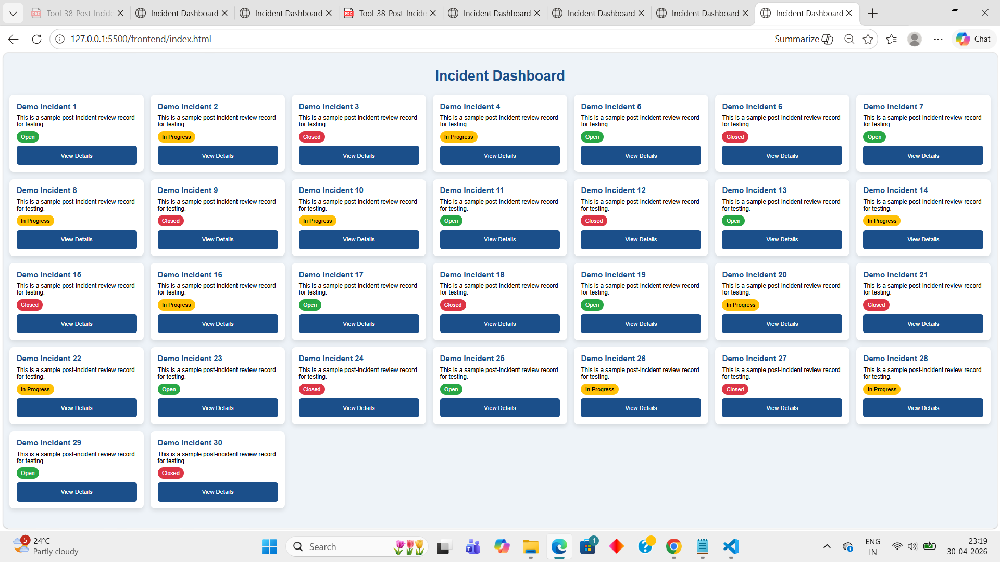

# Post-Incident Review System

##  Project Overview

The Post-Incident Review System is a full-stack application developed to manage and review incidents efficiently.  
The system allows users to create, view, update, and manage incident records with secure authentication and backend integration.

This project was developed as part of the internship sprint project.

---

#  Features

- JWT Authentication
- Incident Management APIs
- Secure REST Endpoints
- Redis Caching
- PostgreSQL Database Integration
- Data Seeder with 30 Demo Records
- Frontend Integration using HTML/CSS/JavaScript
- Responsive UI Design
- API Testing and Validation

# Architecture Diagram

                ┌────────────────────┐
                │     Frontend       │
                │ HTML / CSS / JS    │
                └─────────┬──────────┘
                          ↓
                ┌────────────────────┐
                │ Spring Boot Backend│
                │ REST APIs + JWT    │
                └─────────┬──────────┘
                          ↓
        ┌─────────────────┴─────────────────┐
        ↓                                   ↓
┌──────────────────┐              ┌──────────────────┐
│ PostgreSQL DB    │              │   Redis Cache    │
│ Incident Records │              │ Faster Responses │
└──────────────────┘              └──────────────────┘

# Tech Stack Used

Backend:
- Java 17
- Spring Boot
- Spring Security
- JWT Authentication
- Redis
- PostgreSQL
- Maven

Frontend:
- HTML
- CSS
- JavaScript
- Fetch API

Tools:
- VS Code
- Postman
- Docker Desktop
- Git & GitHub

# Project Structure
post-incident-review-system/
│
├── backend/
│
├── frontend/
│   └── index.html
│
├── screenshots/
│
├── docker-compose.yml
│
├── .env.example
│
└── README.md  

# ⚙ Prerequisites

Before running the project install:

- Java 17
- Maven
- PostgreSQL
- Docker Desktop
- Git
- VS Code

---

# Setup Instructions
1️. Clone Repository
   git clone <repository-url>
2️. Go to Backend Folder
   cd backend
3️. Run Backend
   mvn spring-boot:run

Backend runs on:
http://localhost:8080

4️. Run Frontend
   Open:frontend/index.html in browser

# Environment Variables

Create .env file using below reference:

| Variable    | Description             |
| ----------- | ----------------------- |
| DB_URL      | PostgreSQL database URL |
| DB_USERNAME | Database username       |
| DB_PASSWORD | Database password       |
| JWT_SECRET  | Secret key for JWT      |
| REDIS_HOST  | Redis host              |
| REDIS_PORT  | Redis port              |

# API Endpoint
Get All Incidents
GET /incidents/all
Example:http://localhost:8080/incidents/all

# UI Brand Guidelines Applied
Primary Color: #1B4F8A
Font: Arial
8px spacing grid
44px touch targets

# Output Screenshots
Backend Output

Frontend Output
 

# Project Status
- Backend Completed
- Frontend Integrated
- API Working Successfully
- Data Seeder Implemented
- README Documentation Completed

 Developer
 Priya Udagatti
 Java Developer 1