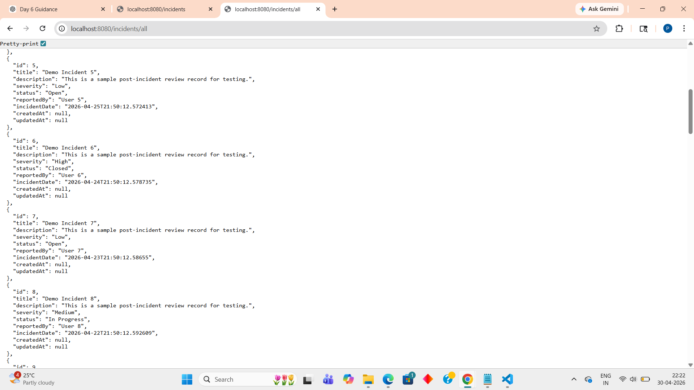
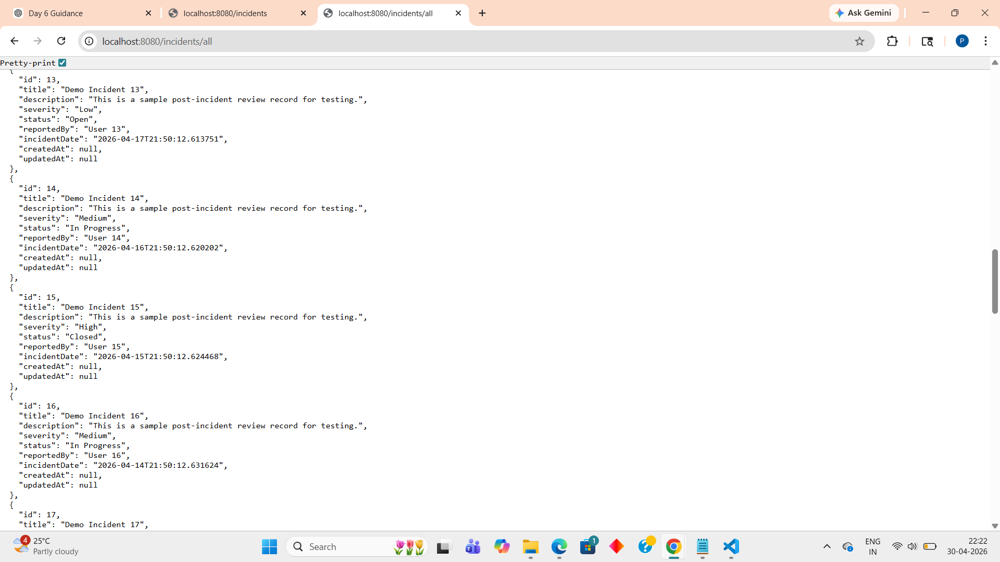
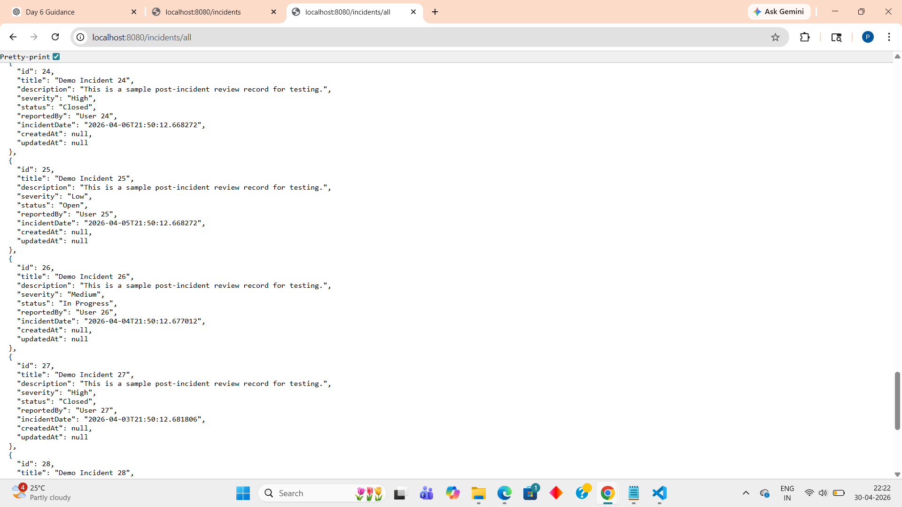

# Post Incident Review System

## My Role
Java Developer 1

## Tech Stack Used
- Java 17
- Spring Boot
- Spring Data JPA
- Maven
- PostgreSQL
- Git
- GitHub
- VS Code

### Day 1
- Spring Boot project setup completed
- Maven configured successfully
- Java 17 environment setup completed
- Project folder structure created
- application.yml configured
- Project build and run verified

### Day 2
- Created Incident entity class
- Added JPA annotations (@Entity, @Table, @Id)
- Added database fields for incident records
- Created IncidentRepository interface
- Added custom query methods
- Build verified successfully

### Day 3
- Implemented IncidentService class
- Added business logic for creating and fetching incidents
- Added input validation for required fields
- Created ResourceNotFoundException class
- Created InvalidDataException class
- Integrated service layer with IncidentRepository
- Verified project build successfully using Maven

### Day 4
- Created IncidentController
- Added GET /all endpoint with pagination
- Added GET /{id} endpoint
- Added POST /create endpoint with @Valid
- Created IncidentRequest DTO
- Verified project build successfully using Maven

### Day 5
- Added JwtUtil class
- Added JwtAuthFilter
- Added SecurityConfig
- Created AuthController
- Added /register, /login, and /refresh endpoints
- Verified project build successfully using Maven

## Day 6 

- Added Redis caching
- Added 10 minute cache time
- Used @Cacheable for GET APIs
- Used @CacheEvict for Create, Update, Delete APIs
- Added RBAC security
- Used @PreAuthorize for role access

### Access
- USER and ADMIN can view data
- ADMIN can add, update, delete data

## Day 7 

- Added email notification feature
- Used JavaMailSender
- Added ReminderService
- Added daily scheduled reminder
- Added deadline alert email
- Enabled scheduling in application

### Schedule
- Daily reminder at 9:00 AM
- Deadline alert at 5:00 PM

## Day 8 Progress

- Added global exception handling
- Added consistent JSON error response
- Added 404 / 400 / 500 handlers
- Added JUnit 5 tests
- Added Mockito tests
- Build successful

## Day 9 Progress

- Added docker-compose.yml in project root
- Configured 5 services:
  - backend
  - PostgreSQL
  - Redis
  - AI service
  - frontend
- Added healthchecks for PostgreSQL and Redis
- Tested Docker commands
- Docker image pull attempted

## Day 10 Progress
I completed integration testing using Docker Compose.
- Executed docker compose down -v and docker compose up --build
- PostgreSQL and Redis containers pulled successfully
- Backend container setup completed with Dockerfile
- Identified and fixed configuration issues during setup
- Backend container build could not be completed due to Docker Hub network issue

## Day 11 Progress

- Fixed issues in service and controller classes
- Created unit tests for IncidentService
- Configured test folder structure correctly
- Ran mvn clean test successfully
- Verified test cases execution

## Day 12 Progress

- Implemented DataSeeder for demo data
- Inserted 30 incident records
- Verified API using browser
- Successfully fetched all incidents

## Output Screenshot

## Day 12 Progress

- Implemented DataSeeder for demo data
- Inserted 30 incident records
- Verified API using browser
- Successfully fetched all incidents

## Day 12 Progress

- Implemented DataSeeder for demo data
- Inserted 30 incident records
- Verified API using browser
- Successfully fetched all incidents
- Created simple frontend UI to display incidents
- Integrated frontend with backend using fetch API
- Resolved CORS issue for frontend-backend communication

Output Screenshots
🔹 Backend (API + Data)

 

 
 

🔹 Frontend (UI Display)
 
